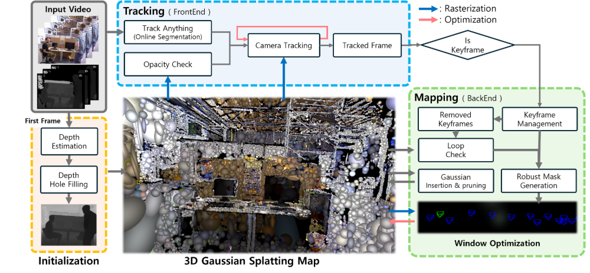

# DGS-SLAM: Dynamic Gaussian Splatting SLAM

## Abstract

Dynamic Gaussian Splatting SLAM (DGS-SLAM) is the first dynamic SLAM framework built on the foundation of **Gaussian Splatting**. While recent advancements in dense SLAM have leveraged Gaussian Splatting to enhance scene representation, most approaches assume a static environment, making them vulnerable to photometric and geometric inconsistencies caused by dynamic objects.

DGS-SLAM addresses these challenges by integrating a **robust filtering process** into the Gaussian Splatting pipeline. This framework effectively handles dynamic objects throughout the entire SLAM pipeline, including **Gaussian insertion** and **keyframe selection**, to achieve robust performance in dynamic environments.

<!-- ## 🔥 Key Features

- **Dynamic Object Filtering**  
  Introduces a robust mask generation method to enforce photometric consistency across keyframes, reducing segmentation noise and artifacts such as shadows.

- **Loop-Aware Optimization**  
  Proposes a loop-aware window selection mechanism that detects and optimizes loops using unique keyframe IDs of 3D Gaussians.

- **State-of-the-Art Results**  
  Achieves superior performance in **camera tracking** and **novel view synthesis** on dynamic SLAM benchmarks.

[➡️ Explore the Code](https://github.com/kmk97/DGS-SLAM) -->

---

## 📜 Pipeline Overview

The DGS-SLAM pipeline incorporates Gaussian Splatting, robust filtering, keyframe management, and loop-aware optimization. Below is a visual representation of the process:

  


---

## 🎥 Results

DGS-SLAM demonstrates state-of-the-art performance in dynamic environments. Check out the example videos below:

<iframe width="560" height="315" src="https://www.youtube.com/embed/Mq3qZTTcN3E" frameborder="0" allow="accelerometer; autoplay; clipboard-write; encrypted-media; gyroscope; picture-in-picture" allowfullscreen></iframe>
 


---

<!-- ## 🚀 Getting Started

### Installation

```bash
# Clone the repository
git clone https://github.com/kmk97/DGS-SLAM.git
cd DGS-SLAM

# Install dependencies
pip install -r requirements.txt -->
